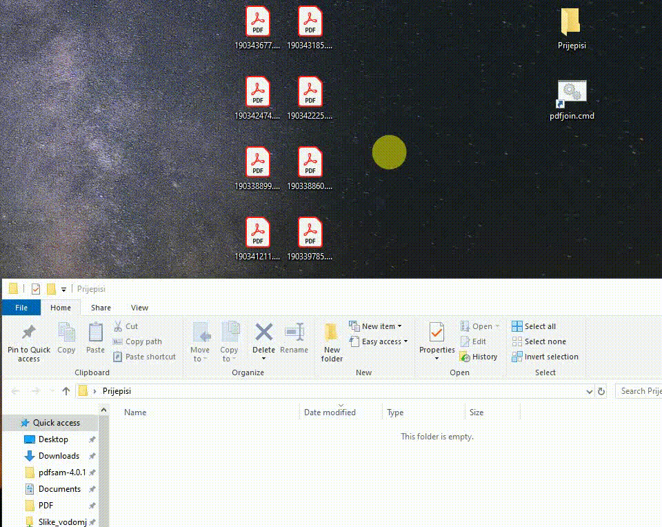

# pdfjoiner
Windows Batch script that uses pdftk (https://www.pdflabs.com/tools/pdftk-the-pdf-toolkit/) to merge multiple pdfs into one single .pdf file

For the first time multi select desired pdfs and pull them into pdfjoin.cmd, then shortcut will be created in your Windows SendTo folder.

Next time just multiselect pdf files, right-click the pdffile you want first to appear in joined pdf file, go to Send To, and left-click the pdfjoin.cmd

